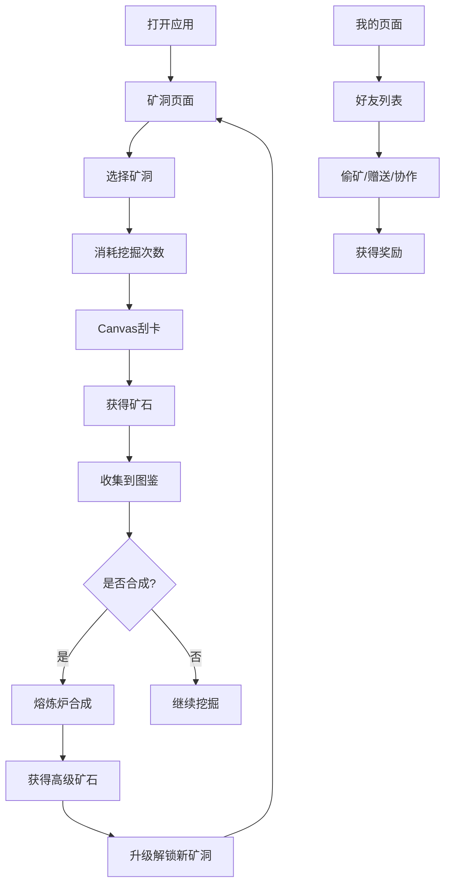

## 1. 产品概述

黄金矿工大冒险是一款集刮卡、收集、挖矿、社交于一体的进阶刮刮乐H5游戏。用户扮演黄金矿工，通过刮开矿洞涂层挖掘黄金和稀有矿石，融入矿石图鉴收集、矿洞探索、熔炼合成、成就系统、好友偷矿、排行榜等丰富玩法，打造沉浸式轻度养成游戏体验。

### 产品目标
- 提供有趣的刮刮乐核心玩法，增强用户粘性
- 通过收集养成系统提升用户留存
- 社交互动增加游戏趣味性和传播性

## 2. 核心功能

### 2.1 用户角色
| 角色 | 注册方式 | 核心权限 |
|------|----------|----------|
| 矿工玩家 | 本地存储自动创建 | 挖掘矿石、收集图鉴、熔炼合成、好友互动 |

### 2.2 功能模块
1. **矿洞页面**：矿洞选择、Canvas刮卡挖掘、次数显示、道具使用
2. **矿石图鉴**：矿石展示墙、系列分类、合成入口、矿石详情
3. **排行榜**：好友榜、全服榜、偷矿榜
4. **我的页面**：矿工信息、成就系统、熔炼炉、道具背包、设置

### 2.3 页面详情
| 页面名称 | 模块名称 | 功能描述 |
|---------|---------|----------|
| 矿洞 | 矿洞选择器 | 多个矿洞主题，不同掉落概率，解锁机制 |
| 矿洞 | 刮卡区域 | Canvas涂层刮除，矿脉提示，多重涂层，炸弹道具 |
| 矿洞 | 次数面板 | 每日免费次数、额外次数获取途径 |
| 矿石图鉴 | 矿石网格 | 50+种矿石展示，已收集/未收集状态 |
| 矿石图鉴 | 系列分类 | 按系列筛选，集齐奖励 |
| 矿石图鉴 | 矿石详情 | 大图展示、获取时间、稀有度 |
| 排行榜 | 好友榜 | 模拟好友排名，矿石数量排序 |
| 排行榜 | 全服榜 | 虚拟全服前50名 |
| 排行榜 | 偷矿榜 | 偷矿成功次数排名 |
| 我的 | 矿工信息 | 等级、经验值、称号 |
| 我的 | 熔炼炉 | 3合1合成系统，成功率机制，熔炼动画 |
| 我的 | 成就系统 | 多种成就解锁，成就展示 |
| 我的 | 道具背包 | 炸弹、稳定剂等道具 |
| 我的 | 好友列表 | 虚拟好友，偷矿/赠送/协作 |

## 3. 核心流程

### 主流程
用户打开应用 → 进入矿洞页面 → 选择矿洞 → 消耗挖掘次数 → 刮开涂层 → 获得矿石 → 收集到图鉴 → 可熔炼合成高级矿石 → 升级解锁新内容

### 社交流程
进入我的页面 → 查看好友列表 → 访问好友矿洞 → 偷取矿石/赠送矿石/协作挖矿

## 4. 用户界面设计

### 4.1 设计风格
- **设计主题**：矿洞探险/黄金矿工主题，温暖复古的游戏风格
- **主色调**：深棕色（#2D1810）背景 + 金色（#FFD700）强调色 + 铜色（#B87333）辅助色
- **辅助色**：矿石颜色根据稀有度区分（普通-灰色、稀有-蓝色、史诗-紫色、传说-金色）
- **按钮风格**：圆角立体按钮，带有金属质感渐变和阴影
- **字体**：使用游戏感强的字体，标题粗体醒目
- **布局风格**：卡片式布局，底部Tab导航，顶部状态栏
- **图标风格**：手绘风格图标，emoji辅助表达
- **动效**：矿石飞出动画、熔炼火焰动画、刮除粒子效果、升级庆祝动画

### 4.2 页面设计概览
| 页面名称 | 模块名称 | UI元素 |
|---------|---------|--------|
| 矿洞 | 顶部栏 | 矿工等级、经验条、挖掘次数 |
| 矿洞 | 矿洞选择 | 横向滚动矿洞卡片，选中高亮 |
| 矿洞 | 刮卡区域 | 大尺寸Canvas卡片，涂层下透出矿石微光 |
| 矿洞 | 道具栏 | 炸弹道具按钮、数量显示 |
| 矿石图鉴 | 顶部筛选 | 稀有度/系列筛选标签 |
| 矿石图鉴 | 矿石网格 | 自适应网格，已收集亮色，未收集剪影 |
| 矿石图鉴 | 详情弹窗 | 矿石大图、名称、稀有度、获取时间 |
| 排行榜 | Tab切换 | 好友榜/全服榜/偷矿榜 |
| 排行榜 | 排名列表 | 头像、昵称、数据、排名徽章 |
| 我的 | 矿工卡片 | 头像、等级、称号、经验进度 |
| 我的 | 功能入口 | 熔炼炉、成就、道具、好友 |
| 我的 | 熔炼炉 | 3个矿石槽位、熔炉动画、合成按钮 |

### 4.3 响应式设计
- 采用移动端优先设计，适配主流手机屏幕尺寸（320px - 430px宽度）
- 底部Tab导航固定，内容区域可滚动
- 触控优化：按钮最小尺寸44px，手势操作流畅
- Canvas刮卡区域适配触控和鼠标操作

### 4.4 动画与交互
- **刮卡交互**：Canvas实时刮除效果，笔触跟随手指/鼠标
- **矿石获得**：矿石从卡片中飞出，带粒子特效，飞入图鉴位置
- **熔炼动画**：火焰燃烧动画，矿石融化发光，新品出炉弹跳效果
- **升级动画**：全屏庆祝动画，彩带飘落，新解锁内容提示
- **按钮反馈**：点击缩放效果，悬停高亮
