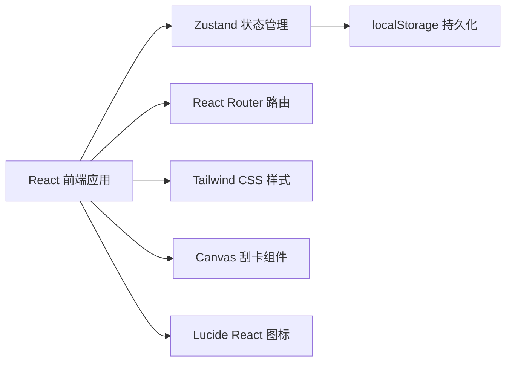

## 1. 架构设计



## 2. 技术描述

- **前端框架**：React 18 + TypeScript
- **构建工具**：Vite 5
- **样式方案**：Tailwind CSS 3
- **状态管理**：Zustand
- **路由管理**：React Router DOM 6
- **图标库**：Lucide React
- **数据持久化**：localStorage
- **核心交互**：Canvas API（刮刮乐效果）

### 技术选型理由
- **React + TypeScript**：组件化开发，类型安全，适合复杂交互
- **Zustand**：轻量级状态管理，API简洁，适合中小型项目
- **Tailwind CSS**：快速开发，响应式设计，统一设计系统
- **Canvas API**：实现流畅的刮刮乐涂层效果
- **localStorage**：无需后端，本地存储用户数据

## 3. 目录结构

```
src/
├── components/          # 公共组件
│   ├── BottomTabNav/   # 底部Tab导航
│   ├── ScratchCard/    # 刮刮卡Canvas组件
│   ├── OreCard/        # 矿石卡片组件
│   ├── MineSelector/   # 矿洞选择器
│   └── ...
├── pages/              # 页面组件
│   ├── MinePage/       # 矿洞页面
│   ├── CollectionPage/ # 矿石图鉴页面
│   ├── RankPage/       # 排行榜页面
│   └── ProfilePage/    # 我的页面
├── store/              # Zustand状态管理
│   └── useGameStore.ts
├── data/               # 静态数据
│   ├── ores.ts         # 矿石数据
│   ├── mines.ts        # 矿洞数据
│   ├── achievements.ts # 成就数据
│   └── friends.ts      # 好友数据
├── hooks/              # 自定义Hooks
│   ├── useScratch.ts   # 刮卡逻辑
│   └── useLocalStorage.ts
├── utils/              # 工具函数
│   ├── gameLogic.ts    # 游戏逻辑
│   └── format.ts       # 格式化工具
├── types/              # TypeScript类型定义
│   └── index.ts
├── App.tsx
├── main.tsx
└── index.css
```

## 4. 路由定义

| 路由路径 | 页面名称 | 说明 |
|---------|---------|------|
| / | 矿洞页面 | 首页，核心刮卡区域 |
| /collection | 矿石图鉴 | 矿石收集展示 |
| /rank | 排行榜 | 好友榜/全服榜/偷矿榜 |
| /profile | 我的 | 矿工信息、熔炼炉、成就 |

## 5. 数据模型

### 5.1 TypeScript 类型定义

```typescript
// 矿石稀有度
type OreRarity = 'normal' | 'rare' | 'epic' | 'legendary';

// 矿石信息
interface Ore {
  id: string;
  name: string;
  emoji: string;
  rarity: OreRarity;
  series: string;
  description: string;
  color: string;
}

// 玩家拥有的矿石
interface PlayerOre {
  oreId: string;
  count: number;
  firstObtained: string;
}

// 矿洞
interface Mine {
  id: string;
  name: string;
  description: string;
  unlockLevel: number;
  unlockCost?: { oreId: string; count: number };
  coatColor: string;
  oreProbabilities: { rarity: OreRarity; probability: number }[];
  layers: number;
  isLimited?: boolean;
  limitedEndDate?: string;
}

// 矿工等级
interface MinerLevel {
  level: number;
  title: string;
  expRequired: number;
  dailyFreeDigs: number;
  bombBonus: number;
  synthesizeBonus: number;
}

// 成就
interface Achievement {
  id: string;
  name: string;
  description: string;
  icon: string;
  reward: { exp?: number; items?: { type: string; count: number }[] };
  condition: (state: GameState) => boolean;
}

// 好友
interface Friend {
  id: string;
  name: string;
  avatar: string;
  level: number;
  recentOre: string;
  totalOres: number;
  stolenToday: number;
}

// 道具
interface Items {
  bomb: number;
  stabilizer: number;
}

// 碎片
interface Fragments {
  normal: number;
  rare: number;
  epic: number;
  legendary: number;
}

// 游戏状态
interface GameState {
  // 矿工信息
  level: number;
  exp: number;
  
  // 每日数据
  todayDate: string;
  dailyDigCount: number;
  freeDigsUsed: number;
  videoDigsUsed: number;
  shareDigsUsed: number;
  giftDigsUsed: number;
  
  // 统计
  totalDigs: number;
  totalSynthesized: number;
  stolenCount: number;
  beenStolenCount: number;
  
  // 矿石收集
  ores: PlayerOre[];
  fragments: Fragments;
  
  // 道具
  items: Items;
  
  // 成就
  achievements: string[];
  
  // 社交
  friends: Friend[];
  stolenFrom: string[];
  stolenBy: string[];
  giftsSent: number;
  
  // 合成记录
  synthesizeHistory: SynthesizeRecord[];
}
```

### 5.2 状态管理设计

使用 Zustand 管理全局游戏状态，包含：
- 矿工等级与经验
- 矿石收集数据
- 道具数量
- 每日挖掘次数
- 成就解锁状态
- 好友与社交数据

状态持久化通过 localStorage 实现。

## 6. 核心功能实现方案

### 6.1 Canvas 刮刮卡
- 使用 Canvas 2D API 绘制涂层
- 监听鼠标/触摸事件，使用 `destination-out` 模式擦除涂层
- 实时计算刮开比例，达到阈值自动全部刮开
- 矿脉提示：涂层下方随机位置绘制微光效果
- 多重涂层：多层Canvas叠加

### 6.2 矿石掉落系统
- 根据矿洞配置的稀有度概率随机选择
- 在对应稀有度矿石中随机选取具体矿石
- 新矿石加入图鉴，重复矿石转化为碎片

### 6.3 熔炼合成系统
- 3个同稀有度矿石合成1个更高稀有度矿石
- 不同稀有度有不同成功率
- 稳定剂道具提升成功率
- 合成动画：CSS动画 + 状态切换

### 6.4 升级系统
- 挖掘、合成、社交行为获得经验
- 达到经验阈值自动升级
- 升级解锁新矿洞、增加每日次数等

## 7. 性能优化

- Canvas刮卡区域限制重绘范围
- 图片懒加载（矿石图标使用emoji，无额外图片）
- 使用 React.memo 优化组件渲染
- 状态按需订阅，避免不必要的重渲染

## 8. 数据持久化

- 使用 localStorage 存储游戏状态
- 页面加载时从 localStorage 恢复
- 关键操作（获得矿石、使用道具等）后自动保存
- 每日数据按日期重置
